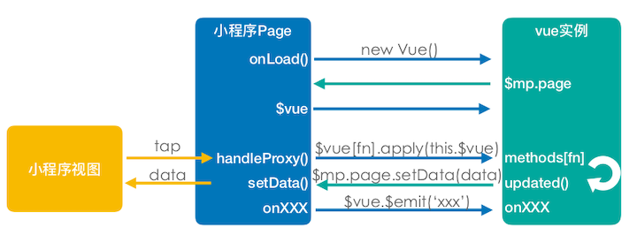
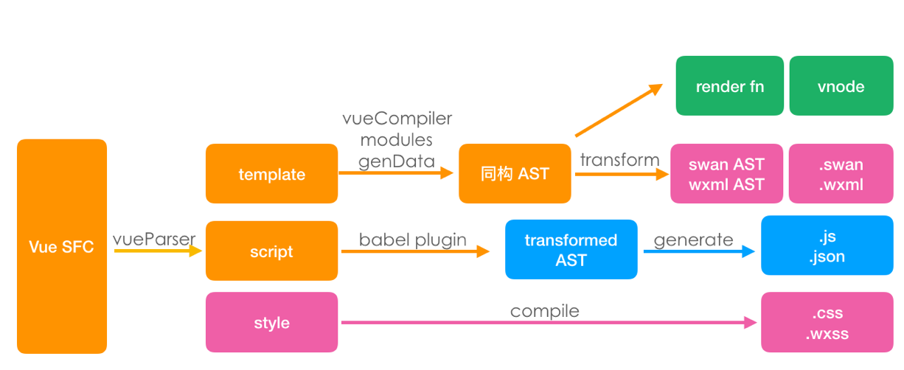

# 如何贡献

### 开发准备

```shell
# 在项目目录下执行 要求 node >= 8.10

npm install
npm run bootstrap

```

### 代码结构

```
docs                // 文档目录
examples            // 示例项目代码
packsges
    |- mars-build   // 编译相关代码
    |- mars-core    // 运行时代码
    |- mars-cli     // CLI 代码
    |- mars-cli-template  // CLI Service 代码
    |- mars-api     // 适配 H5 的 API 代码
```

### 单元测试
提交代码前先运行单元测试，新增代码需同时提供对应的单元测试代码。

```shell
# 在项目目录下执行
npm test
```

### 提交代码

提交信息需要使用 conventional commit 格式，即：
```
type(scope?): subject  #scope is optional
```

### 框架原理


#### 运行时


#### 编译和构建
