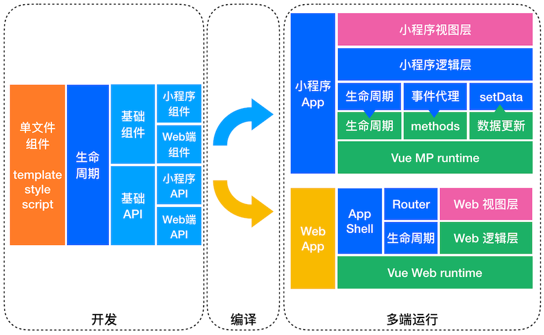
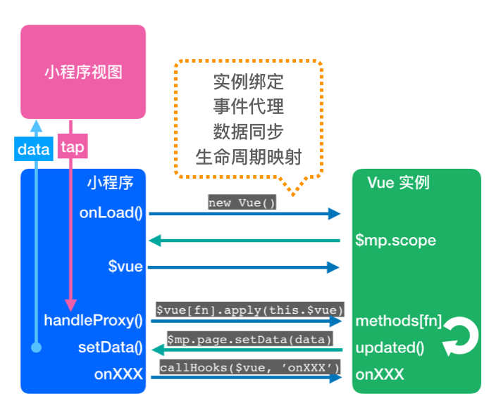
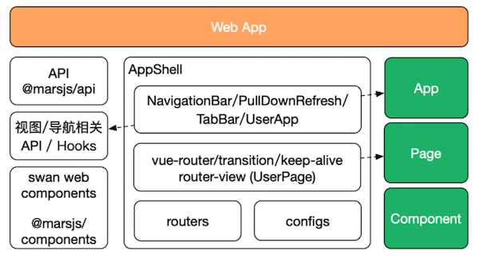
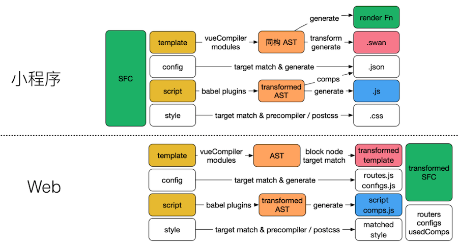

# 如何贡献

### 开发准备

```shell
# 在项目目录下执行 要求 node >= 8.10

npm install
npm run bootstrap

```

### 代码结构

```
docs                // 文档目录
packsges
    |- mars-build   // 编译相关代码
    |- mars-core    // 运行时代码
    |- mars-cli     // CLI 代码
    |- mars-cli-template  // CLI Service 代码
    |- mars-api     // 适配 H5 的 API 代码
```

### 单元测试
提交代码前先运行单元测试，新增代码需同时提供对应的单元测试代码。

```shell
# 在项目目录下执行
npm test
```

### 提交代码

提交信息需要使用 conventional commit 格式，即：
```
type(scope?): subject  #scope is optional
```
也可以使用 `npm run commit` 命令来对话式的生成提交信息。

注意 scope 表示 packages 下的包名，如 `api|build|core|cli|cli-template`，修改 packages 下的内容必须加上正确的 scope。

type 只能是以下这些：

* **feat**: A new feature
* **fix**: A bug fix
* **test**: Adding missing tests or correcting existing tests
* **docs**: Documentation only changes
* **perf**: A code change that improves performance
* **refactor**: A code change that neither fixes a bug nor adds a feature
* **style**: Changes that do not affect the meaning of the code (white-space, formatting, missing semi-colons, etc)
* **build**: Changes that affect the build system or external dependencies (example scopes: gulp, broccoli, npm)
* **ci**: Changes to our CI configuration files and scripts (example scopes: Travis, Circle, BrowserStack, SauceLabs)
* **chore**

目前可以提交下列类型的贡献：

#### 1、Bug 修复

请创建对应的 Issue 并提 PR 与 Issue 关联即可，我们会尽快处理。


#### 2、修改文档

用户使用文档在 `docs` 目录，使用 [vuepress](https://v0.vuepress.vuejs.org/zh/) 工具发布。

修改文档时可以使用 `npm run docs:dev` 来预览。修改完成请发 PR 到 `master` 分支，此时会自动生成 netlify 的预览（在 PR 的状态检查中可以看到）。PR 合入 `master` 分支后，文档会自动部署到线上文档地址。

#### 3、新功能

新功能请先提 Issue，经过讨论沟通之后再开发及提 PR。 


### 框架原理



#### 小程序运行时


#### H5 运行时



#### 编译和构建
