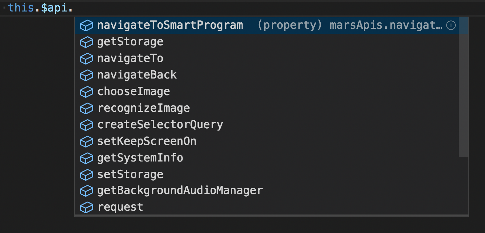

# 使用 TypeScript 开发

> 请先熟悉 Vue 中使用 TypeScript 的方法：[https://vuejs.org/v2/guide/typescript.html](https://vuejs.org/v2/guide/typescript.html)

## 快速上手

```javascript
<script lang="ts">
import {Vue} from '@marsjs/core';

export default Vue.extend({
    data() {
        return {
            xxx: 111
        };
    },
    ...
});
<script>
```

**一定要从 `@marsjs/core` 中引入 Vue**，不支持 `import Vue from 'vue';`。

## 类型定义

`@marsjs/core` 中定义了全局的 `swan` 变量，声明了 `this.$api`。




补充类型定义工作量很大，目前覆盖率还有限，欢迎大家提 PR 进行补充。类型定义文件位置：`Mars/packages/mars-core/types/`。

此外，在本地项目中补充 d.ts 文件，**可以自定义扩展类型定义**：

- 扩展 `swan` 全局变量：

    ```javascript
    import {Vue} from '@marsjs/core';

    declare module '@marsjs/core/types/swan' {
        interface swan {
            
        }
    }
    ```

- 扩展 `this.$api`：

    ```javascript
    import {Vue} from '@marsjs/core';

    declare module '@marsjs/core/types/mars' {
        interface marsApis {

        }
    }
    ```